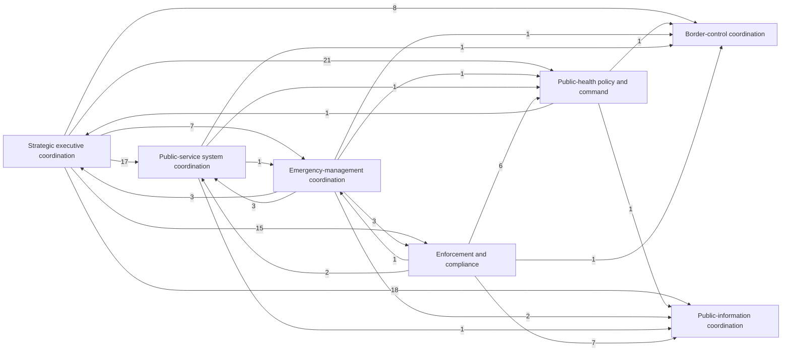

# First-Pass Dependency Graph

## Purpose

This file turns the current [Event Ledger Seed](event-ledger-seed.md) into a simple directed dependency graph.

It is still pre-estimator and deliberately coarse. Each coded event bundle contributes one counted directional link from the issuing unit to each receiving unit named in that event.

## Readout rule

- event bundles are counted once
- edges are unweighted beyond event count
- this is a route-support graph, not a final `I` estimator
- the point is to see whether the current seed already exposes stable directional structure

## Aggregated edge counts

### Strategic executive coordination as issuing hub

- strategic executive coordination -> public-health policy and command = `21`
- strategic executive coordination -> public-information coordination = `18`
- strategic executive coordination -> public-service system coordination = `17`
- strategic executive coordination -> enforcement and compliance = `15`
- strategic executive coordination -> border-control coordination = `8`
- strategic executive coordination -> emergency-management coordination = `7`

### Other issuing units

- public-health policy and command -> strategic executive coordination = `1`
- public-health policy and command -> border-control coordination = `1`
- public-health policy and command -> public-information coordination = `1`
- emergency-management coordination -> strategic executive coordination = `3`
- emergency-management coordination -> public-service system coordination = `3`
- emergency-management coordination -> public-health policy and command = `1`
- emergency-management coordination -> border-control coordination = `1`
- emergency-management coordination -> public-information coordination = `2`
- emergency-management coordination -> enforcement and compliance = `3`
- public-service system coordination -> public-health policy and command = `1`
- public-service system coordination -> emergency-management coordination = `1`
- public-service system coordination -> border-control coordination = `1`
- public-service system coordination -> public-information coordination = `1`
- enforcement and compliance -> public-health policy and command = `6`
- enforcement and compliance -> public-information coordination = `7`
- enforcement and compliance -> border-control coordination = `1`
- enforcement and compliance -> emergency-management coordination = `1`
- enforcement and compliance -> public-service system coordination = `2`

## Mermaid sketch

## What this graph already shows

### 1. A strong issuing centre

The current seed is not a flat web. It has one clear issuing hub:

- `strategic executive coordination`

That does not prove command monocausality. It does show that the route is picking up a directional centre rather than an undifferentiated institutional fog.

### 2. Public-information coordination is not peripheral

Even in this coarse graph:

- public-information coordination is the second most frequent receiving node from the strategic centre
- it receives more counted links than border-control coordination or emergency-management coordination
- it remains tightly coupled to the new April-May transition chain rather than appearing only at the March crisis peak
- it now also receives repeated implementation-side links from enforcement and compliance and emergency-management coordination, including the extended Level 4 continuity chain and transition-period planning

That reinforces the seed readout's main bounded claim: public-information coordination is part of the core working architecture.

### 3. Response operations are differentiated

The current seed also distinguishes between:

- public-health command
- public-service coordination
- border-control coordination
- enforcement and compliance
- emergency-management coordination
- local-authority and CDEM welfare-support routing through emergency-management and public-service links

The graph is therefore already doing more than just separating "government" from "public." It now shows both an implementation-side issuer surface and a small public-service issuer surface rather than only a top-down strategic hub.

## Limits

This graph still does **not** capture:

- lag
- chain length
- edge timing density inside narrower windows
- edge strength differences inside the same event bundle
- whole-system comparison against Comparator A and Comparator B in a final estimator sense

## Relation to the readout

This graph is the structural companion to:

- [First-Pass Seed Readout](first-pass-seed-readout.md)
- [First-Pass `I` Summary](first-pass-i-summary.md)

The readout gives the first interpretive claim. This file shows the directional shape underneath that claim and the first minimal integration summary.

## Status

`first-pass graph`
