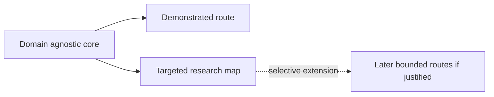

# Domain Expansion Map (diagram spec)

**Core:** domain-agnostic framework in `framework/`.

**Current demonstrated route:** states / societies -> institutional coordination under perturbation -> New Zealand case package.

**Current atlas:** targeted research map with foundations and methods, governance domains, comparative extensions, and a small frontier set.

**Note:** breadth of possible domains does not imply the framework is already validated everywhere.
