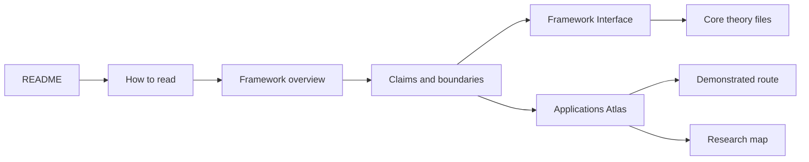

# Reading Path (diagram spec)

**Paths**

- newcomer: README -> how-to-read -> overview -> claims -> Framework Interface -> core files
- demonstrated-route first: README -> claims -> applications -> demonstrated route -> research docs -> framework
- atlas first: README -> applications -> research map -> selected nodes -> framework
