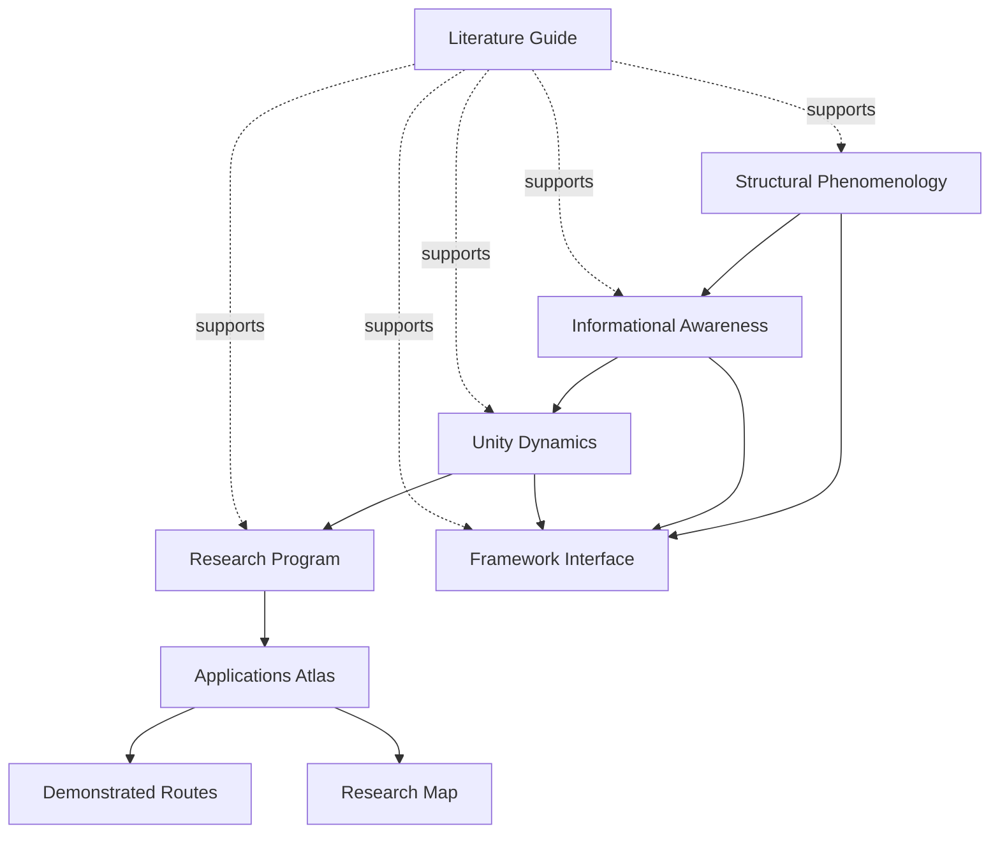

# Dependency Map (diagram spec)

**Non-circularity (intent)**

- Structural Phenomenology grounds the epistemic starting point
- Informational Awareness extends structural description without replacing givenness
- Unity Dynamics adds `I`, `C`, `L`, and `U` at explicit `(tau, sigma)`
- Framework Interface keeps claims typed and layered
- Research Program instantiates the route design and methods bundle
- Literature Guide routes source support
- Applications Atlas exposes bounded demonstrated routes and exploratory extension nodes

**What does not justify what**

- phenomenology literature does not automatically support full operational claims
- methods do not replace layer separation
- applications do not prove universal framework truth
