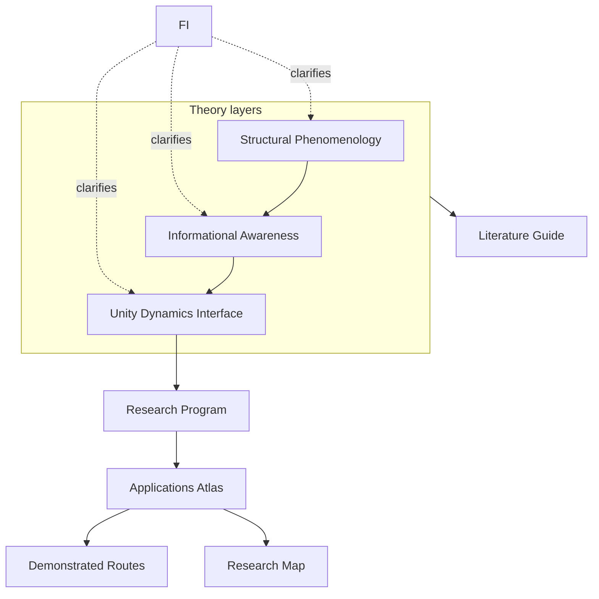

# Framework Stack (diagram spec)

**Notes**

- later theory layers extend earlier ones; Interface explains bridges without replacing sources
- Research Program operationalizes Unity Dynamics constraints; Literature Guide routes support for all layers
- Applications split into demonstrated routes and the targeted research map
